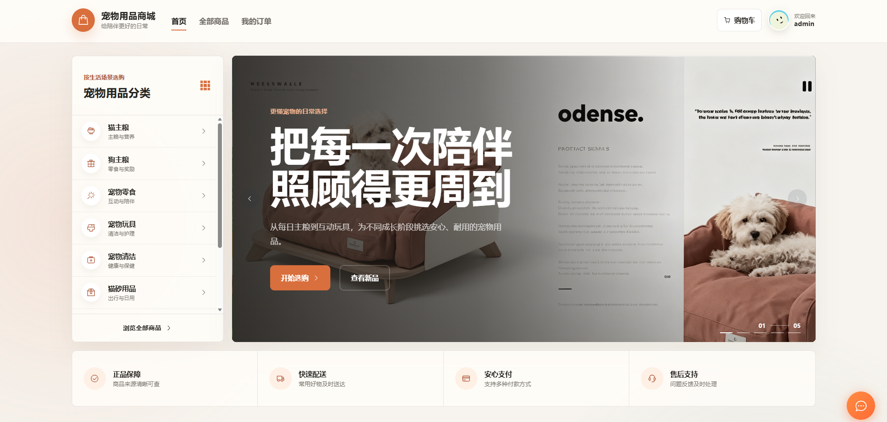
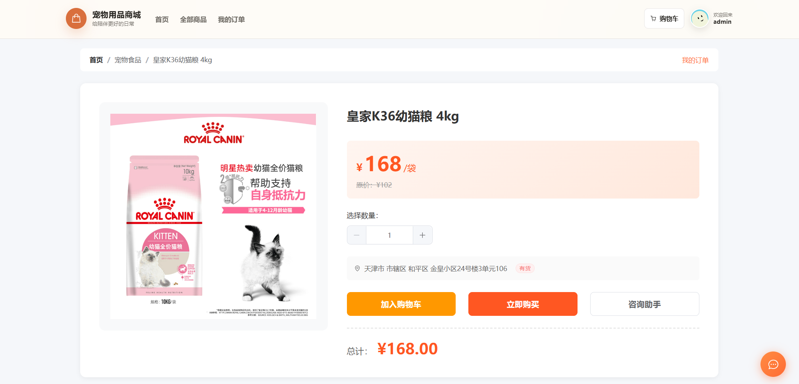
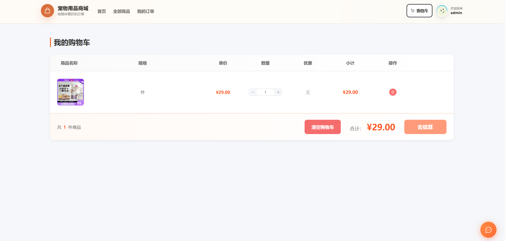
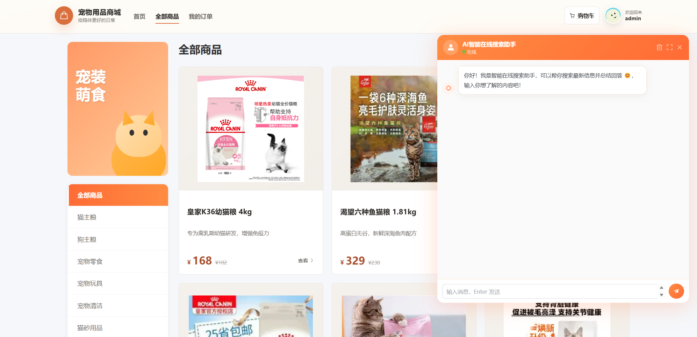
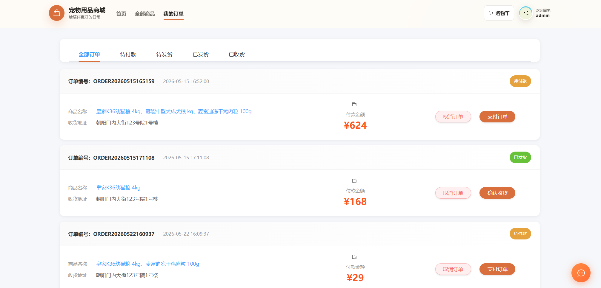
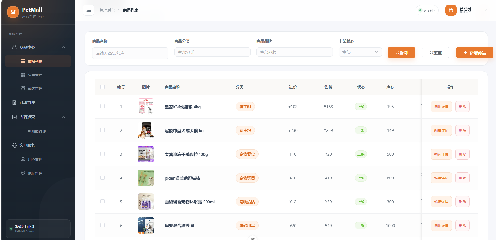
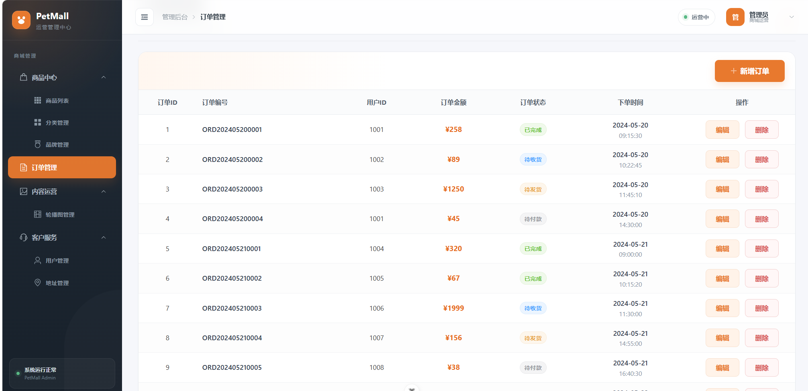
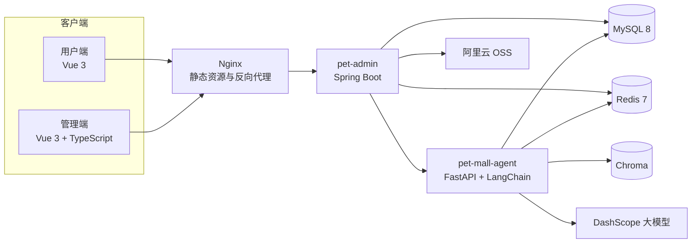
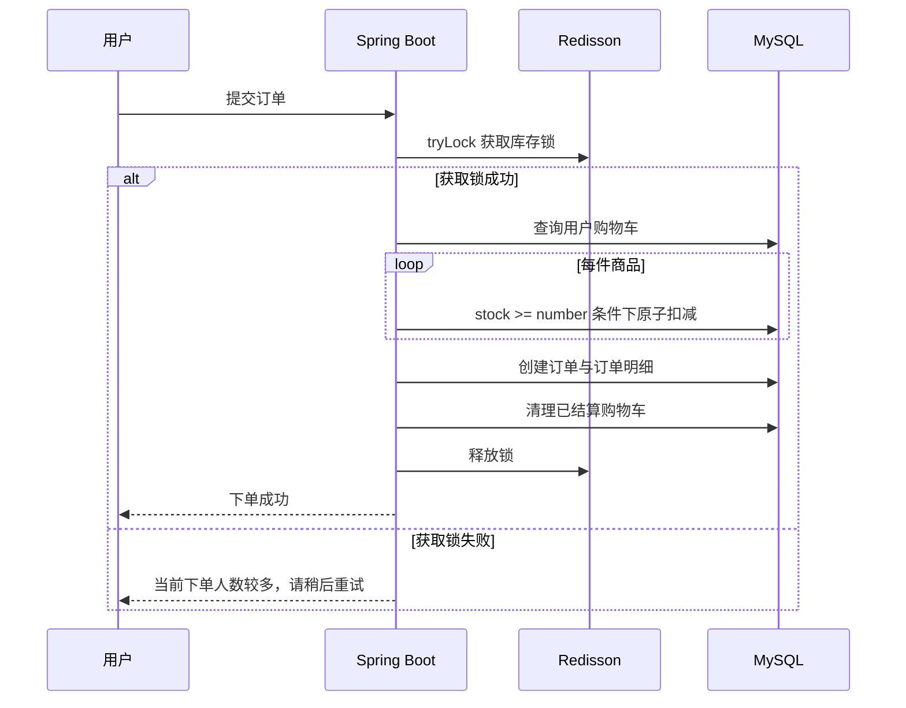
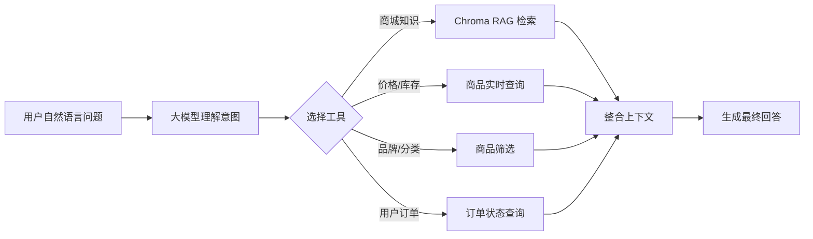

<div align="center">

# PetMall 宠物用品商城

### 面向真实电商流程的前后端分离商城，融合 AI 智能导购、RAG 知识检索与并发库存治理

<p>
  
  
  
  
  
  
  
</p>

PetMall 不只是一个商品 CRUD 项目。它覆盖了从商品浏览、购物车、下单、库存扣减到后台运营的完整商城链路，并在用户端集成能够调用业务工具、查询实时数据和检索知识库的 AI 智能助手。

</div>



## 项目概览

项目采用前后端分离与多服务协作架构，由用户商城、运营管理端、Java 业务服务和 Python Agent 服务组成。

| 子项目 | 职责 | 核心能力 |
| --- | --- | --- |
| `pet-vue-user` | 用户端商城 | 商品浏览、购物车、订单、地址、AI 咨询 |
| `pet-vue` | 运营管理端 | 商品、分类、品牌、订单、用户、轮播图管理 |
| `pet-admin` | 核心业务后端 | 鉴权、商城业务、缓存、事务、库存并发控制 |
| `pet-mall-agent` | AI 智能助手 | RAG 检索、工具调用、实时数据库查询、会话记忆 |

## 为什么值得看

| 完整业务闭环 | AI 与业务融合 | 并发与数据安全 | 工程化部署 |
| --- | --- | --- | --- |
| 用户端与管理端双前端，覆盖完整商城流程 | Agent 不只聊天，还能查询真实商品与订单 | Redisson 锁配合数据库原子扣库存 | Nginx、MySQL、Redis、后端与 Agent 统一编排 |
| 商品、购物车、地址、订单和运营管理 | RAG 知识库与 MySQL 实时数据协同回答 | 事务包裹下单、明细写入与购物车清理 | 支持 Docker Compose 一键构建与启动 |

## 页面展示

### 商品浏览与购买

用户可以从商城首页进入分类商品列表，在详情页选择购买数量并加入购物车。商品详情包含实时售价、库存状态和智能咨询入口。

<table>
  <tr>
    <td width="50%"></td>
    <td width="50%"></td>
  </tr>
  <tr>
    <td align="center">商品详情与数量选择</td>
    <td align="center">购物车数量调整、删除与结算</td>
  </tr>
</table>

### AI 智能咨询助手

助手嵌入用户端页面，能够理解自然语言，并根据问题自主选择知识库检索或业务查询工具。



典型能力包括：

- 查询商品实时价格、库存和上下架状态；
- 按品牌或分类筛选当前在售商品；
- 查询当前用户最近订单或指定订单状态；
- 从 Chroma 向量库检索养宠知识与商城说明；
- 使用 Redis 保存多轮历史会话，并在 24 小时后自动清理；
- 隐藏工具执行过程，仅向用户展示整理后的最终回答。

### 订单履约

用户订单页按状态组织订单，支持待付款、待发货、已发货和已收货等业务阶段，并提供支付、取消和确认收货操作。



### 运营管理

管理端为商城运营人员提供统一工作台，列表采用筛选区、状态标签和操作区布局，可完成商品与订单的日常维护。

<table>
  <tr>
    <td width="50%"></td>
    <td width="50%"></td>
  </tr>
  <tr>
    <td align="center">商品、分类、库存和上下架管理</td>
    <td align="center">订单状态与履约管理</td>
  </tr>
</table>

## 系统架构



## 核心业务流程

### 下单与库存扣减



下单流程使用两层保护：

1. **Redisson 分布式锁**：避免多个应用实例同时进入关键库存流程；
2. **数据库条件更新**：通过 `stock >= 购买数量` 与 `setDecrBy` 原子扣减，即使高并发下也不会将库存扣成负数。

订单创建、订单明细写入、库存扣减和购物车清理位于同一事务中，任一环节失败都会回滚。

### Agent 工具调用



前端只需提交用户的原始问题 `query`。Agent 根据工具描述自动识别意图，并从自然语言中提取 `product_name`、`category_name`、`order_no` 等结构化参数，再调用对应工具。

## 项目亮点

### 1. Redis 缓存与一致性处理

- 缓存商品详情：`product_detail:{id}`；
- 缓存分类商品：`product_list:{categoryId}`；
- 缓存全部商品：`product_all`；
- 缓存用户信息，减少重复数据库查询；
- 后台更新商品后主动删除对应商品详情、分类列表和全部商品缓存，避免用户读取旧数据。

项目采用简单清晰的 Cache Aside 思路：查询时缓存未命中再访问数据库，更新时先修改数据库再删除相关缓存。

### 2. Redisson + 数据库原子操作防止超卖

仅使用普通 Java 本地锁无法覆盖多个后端实例，因此项目使用 Redis 上的 `RLock` 协调分布式并发。数据库扣库存时再次增加库存条件，形成“分布式锁控制流程、SQL 保证最终正确性”的双重保护。

### 3. Agent 不依赖单一知识来源

助手同时拥有三类信息来源：

- **知识库资料**：通过向量检索回答养宠知识和商城说明；
- **实时业务数据**：通过 SQLAlchemy 查询 MySQL 中的价格、库存和订单；
- **会话上下文**：通过 Redis 恢复最近对话，实现连续提问。

这种设计避免了把可能变化的价格和库存写死在提示词或向量库中。

### 4. 工具参数由自然语言自动提取

例如用户输入：

```text
帮我查询皇家 K36 猫粮多少钱
```

Agent 会选择商品价格库存工具，并构造：

```json
{
  "product_name": "皇家 K36 猫粮"
}
```

后端再使用关键词拆分与 SQL `LIKE` 条件完成模糊查询，使不完整商品名也能命中真实商品。

### 5. 用户端与运营端职责分离

- 用户端关注商品发现、购买和订单履约；
- 管理端关注商品资料、库存、分类、品牌和订单状态；
- 两端共享统一后端接口与认证体系，但拥有独立路由和页面结构。

### 6. 容器化多服务部署

生产环境通过 Docker Compose 编排：

- MySQL：业务数据持久化；
- Redis：缓存、会话和分布式锁；
- Spring Boot：核心商城业务；
- FastAPI：AI Agent 服务；
- Nginx：用户端与管理端静态资源、API 反向代理。

## 功能清单

### 用户端

- [x] 用户注册、登录与 JWT 鉴权
- [x] 首页轮播、分类导航与商品展示
- [x] 商品分类筛选、详情查看和数量选择
- [x] 购物车增加、减少、删除和清空
- [x] 收货地址及默认地址管理
- [x] 订单创建、支付、取消、确认收货和状态筛选
- [x] AI 智能咨询与多轮会话

### 管理端

- [x] 管理员认证
- [x] 商品新增、编辑、删除与上下架管理
- [x] 分类和品牌管理
- [x] 订单状态管理
- [x] 用户和地址管理
- [x] 轮播图与内容运营
- [x] OSS 图片上传

## 技术栈

| 层级 | 技术 |
| --- | --- |
| 核心后端 | Java 17、Spring Boot 3.5、MyBatis-Plus、PageHelper |
| 安全与并发 | JWT、Redis、Redisson、Spring Transaction |
| 数据存储 | MySQL 8、Redis 7、Chroma |
| 用户端 | Vue 3、Vite、Element Plus、Pinia、Vue Router、GSAP |
| 管理端 | Vue 3、TypeScript、Vite、Element Plus、ECharts |
| AI 服务 | Python 3.11、FastAPI、LangChain、SQLAlchemy、DashScope |
| 工程部署 | Maven、Nginx、Docker、Docker Compose |

## 目录结构

```text
pet-mall/
├── pet-admin/              # Spring Boot 核心业务后端
├── pet-vue/                # Vue 管理端
├── pet-vue-user/           # Vue 用户端
├── pet-mall-agent/         # FastAPI + LangChain Agent
├── docs/images/            # README 项目截图
└── README.md
```

## 快速启动

### 环境要求

- JDK 17+
- Maven 3.9+
- Node.js 20+
- Python 3.11+
- MySQL 8+
- Redis 7+

### 启动后端

复制配置示例并填写数据库、Redis、JWT 和 OSS 参数：

```powershell
Copy-Item pet-admin/src/main/resources/application.example.yml `
  pet-admin/src/main/resources/application.yml

cd pet-admin
.\mvnw.cmd spring-boot:run
```

### 启动管理端

```bash
cd pet-vue
npm install
npm run dev
```

### 启动用户端

```bash
cd pet-vue-user
npm install
npm run dev
```

### 启动 Agent

```powershell
cd pet-mall-agent
python -m venv .venv
.\.venv\Scripts\activate
pip install -r requirements.txt
uvicorn main:app --host 0.0.0.0 --port 8000
```

Agent 需要配置以下环境变量：

```env
MYSQL_HOST=localhost
MYSQL_PORT=3306
MYSQL_USER=pet_app
MYSQL_PASSWORD=your_mysql_password
MYSQL_DATABASE=pet_mall
REDIS_HOST=localhost
REDIS_PORT=6379
DASHSCOPE_API_KEY=your_dashscope_api_key
```

## Docker Compose 部署

```bash
# 构建并启动
docker compose up -d --build

# 查看服务状态
docker compose ps

# 查看日志
docker compose logs --tail=100
```

更新代码后：

```bash
docker compose down
docker compose build --no-cache
docker compose up -d
```

> 请勿将 MySQL、Redis 直接暴露到公网，也不要提交数据库密码、DashScope API Key、OSS AccessKey 等敏感信息。

## 后续计划

- [ ] 完善自动化测试与接口测试覆盖率
- [ ] 引入消息队列处理订单异步任务
- [ ] 增加商品收藏、评价和优惠券模块
- [ ] 为 Agent 增加商品推荐与售后问答工具
- [ ] 增加监控、健康检查和自动化部署流水线

## 项目说明

本项目用于学习实践、课程设计与个人作品展示。欢迎通过 Issue 交流实现思路。
