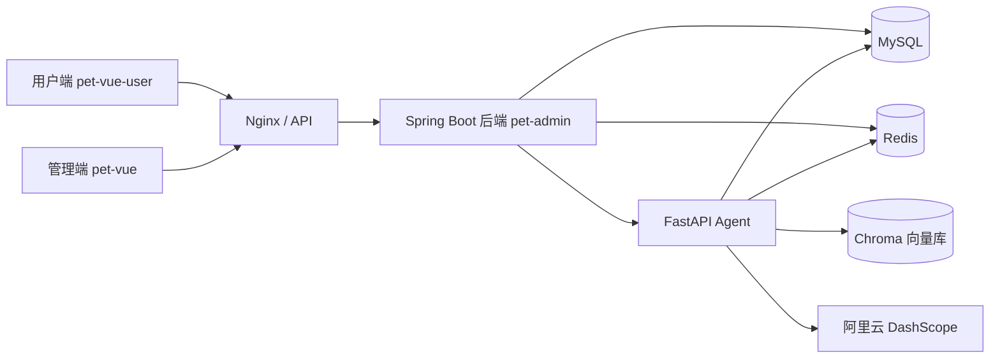

# PetMall 宠物用品商城

PetMall 是一个前后端分离的宠物用品商城项目，包含用户商城、运营管理端、Spring Boot 后端服务和 AI 智能咨询助手。项目覆盖商品浏览、购物车、订单、地址管理、后台运营以及基于大模型的商品与订单查询等完整业务流程。

## 项目架构



## 项目组成

| 目录 | 说明 | 默认端口 |
| --- | --- | --- |
| `pet-admin` | 商城后端与管理端接口 | `8080` |
| `pet-vue` | 商城运营管理端 | `5173` |
| `pet-vue-user` | 商城用户端 | `3000` |
| `pet-mall-agent` | AI 智能咨询助手 | `8000` |

## 主要功能

### 用户端

- 用户注册、登录和身份认证
- 商品分类浏览、商品搜索与详情展示
- 商品加入购物车、数量调整、单项删除和清空购物车
- 收货地址管理与默认地址设置
- 订单提交、订单查询和订单删除
- AI 咨询助手与多轮历史会话

### 管理端

- 管理员登录与注册
- 商品、分类和品牌管理
- 订单管理
- 用户管理
- 收货地址管理
- 轮播图与内容运营
- 图片上传

### AI 智能助手

- 从 Chroma 向量库检索宠物用品资料
- 查询商品价格、库存和上架状态
- 按商品品牌或分类查询商品
- 查询当前用户的订单和订单状态
- Redis 保存会话历史，历史记录 24 小时后自动过期
- 对模型网络异常进行自动重试

## 技术栈

### 后端

- Java 17
- Spring Boot 3.5
- MyBatis-Plus
- MySQL 8
- Redis
- Redisson
- JWT
- PageHelper
- Maven

### 管理端

- Vue 3
- TypeScript
- Vite
- Element Plus
- Pinia
- Vue Router
- Axios
- ECharts

### 用户端

- Vue 3
- Vite
- Element Plus
- Pinia
- Vue Router
- Axios
- GSAP
- Markdown-It

### AI Agent

- Python 3.11
- FastAPI
- LangChain
- DashScope
- SQLAlchemy
- Chroma
- Redis
- PyMySQL

## 项目亮点

- 使用 JWT 区分用户端与管理端身份认证。
- 使用 Redis 缓存商品列表和商品详情，并在商品更新后主动清理缓存。
- 使用 Redisson 分布式锁保护订单库存扣减流程，降低并发超卖风险。
- 购物车支持按用户和商品维度增加、减少及删除商品。
- Agent 根据用户自然语言自动选择工具并提取工具参数。
- Agent 同时支持向量知识检索、MySQL 实时查询和 Redis 会话记忆。
- 前端使用 Markdown 渲染并优化 AI 回复的标题、列表和正文层级。
- 支持 Docker Compose 部署 MySQL、Redis、后端、Agent 和 Nginx。

## 本地运行

### 环境要求

- JDK 17+
- Maven 3.9+
- Node.js 20+
- Python 3.11+
- MySQL 8+
- Redis 7+

### 1. 准备数据库

创建数据库：

```sql
CREATE DATABASE pet_mall
    DEFAULT CHARACTER SET utf8mb4
    COLLATE utf8mb4_unicode_ci;
```

然后将项目对应的数据库脚本导入 `pet_mall`。

### 2. 启动后端

复制配置示例并填写本地参数：

```bash
cp pet-admin/src/main/resources/application.example.yml \
   pet-admin/src/main/resources/application.yml
```

Windows PowerShell：

```powershell
Copy-Item pet-admin/src/main/resources/application.example.yml `
  pet-admin/src/main/resources/application.yml
```

```bash
cd pet-admin

# Windows
mvnw.cmd spring-boot:run

# Linux / macOS
./mvnw spring-boot:run
```

后端默认地址：

```text
http://localhost:8080
```

### 3. 启动管理端

```bash
cd pet-vue
npm install
npm run dev
```

管理端默认地址：

```text
http://localhost:5173
```

### 4. 启动用户端

```bash
cd pet-vue-user
npm install
npm run dev
```

用户端默认地址：

```text
http://localhost:3000
```

### 5. 启动 AI Agent

```bash
cd pet-mall-agent

python -m venv .venv

# Windows
.\.venv\Scripts\activate

# Linux / macOS
source .venv/bin/activate

pip install -r requirements.txt
uvicorn main:app --host 0.0.0.0 --port 8000
```

Agent 接口示例：

```http
GET /agent/stream?query=皇家K36猫粮多少钱&session_id=demo&user_id=1
```

## 环境变量

Agent 推荐通过 `.env` 或 Docker Compose 配置以下变量：

```env
MYSQL_HOST=localhost
MYSQL_PORT=3306
MYSQL_USER=pet_app
MYSQL_PASSWORD=your_mysql_password
MYSQL_DATABASE=pet_mall

REDIS_HOST=localhost
REDIS_PORT=6379

DASHSCOPE_API_KEY=your_dashscope_api_key
```

生产环境前端推荐使用相对 API 地址：

```env
VITE_API_BASE_URL=/api
```

## Docker 部署

准备好 `docker-compose.yml` 后，可以使用以下命令构建并启动全部服务：

```bash
docker compose up -d --build
```

代码更新后重新构建：

```bash
docker compose down
docker compose build --no-cache
docker compose up -d
```

查看服务状态和日志：

```bash
docker compose ps
docker compose logs --tail=100
```

> 不要随意执行 `docker compose down -v`，该命令会删除 Compose 管理的数据卷。

## 目录结构

```text
pet-mall/
├── pet-admin/        # Spring Boot 后端
├── pet-vue/          # Vue 管理端
├── pet-vue-user/     # Vue 用户端
├── pet-mall-agent/   # FastAPI + LangChain 智能助手
└── README.md
```

## 安全说明

提交到公开 GitHub 仓库之前，请务必完成以下检查：

- 不要提交真实的数据库密码。
- 不要提交 DashScope API Key。
- 不要提交阿里云 OSS AccessKey。
- 不要提交 `.env`、`.venv`、`node_modules`、`target`、`dist` 和日志文件。
- 如果密钥曾经出现在 Git 记录或公开截图中，请立即前往对应平台撤销并重新生成。

推荐只提交 `.env.example`：

```env
DASHSCOPE_API_KEY=
MYSQL_PASSWORD=
```

## GitHub 推送

当前各子项目可能保留了各自的 `.git` 目录。如果希望将四个项目作为一个仓库上传，需要先决定是否保留原有提交历史：

- 作为单体仓库上传：备份后移除各子项目中的 `.git`，再在根目录初始化 Git。
- 保留独立仓库：使用 Git Submodule 管理，不要直接执行根目录 `git add .`。

确认密钥已经撤销或移出代码、忽略规则正确后，再执行：

```bash
git init
git add .
git commit -m "feat: initialize PetMall project"
git branch -M main
git remote add origin https://github.com/your-name/pet-mall.git
git push -u origin main
```

## License

本项目仅用于学习、课程设计和技术交流。
